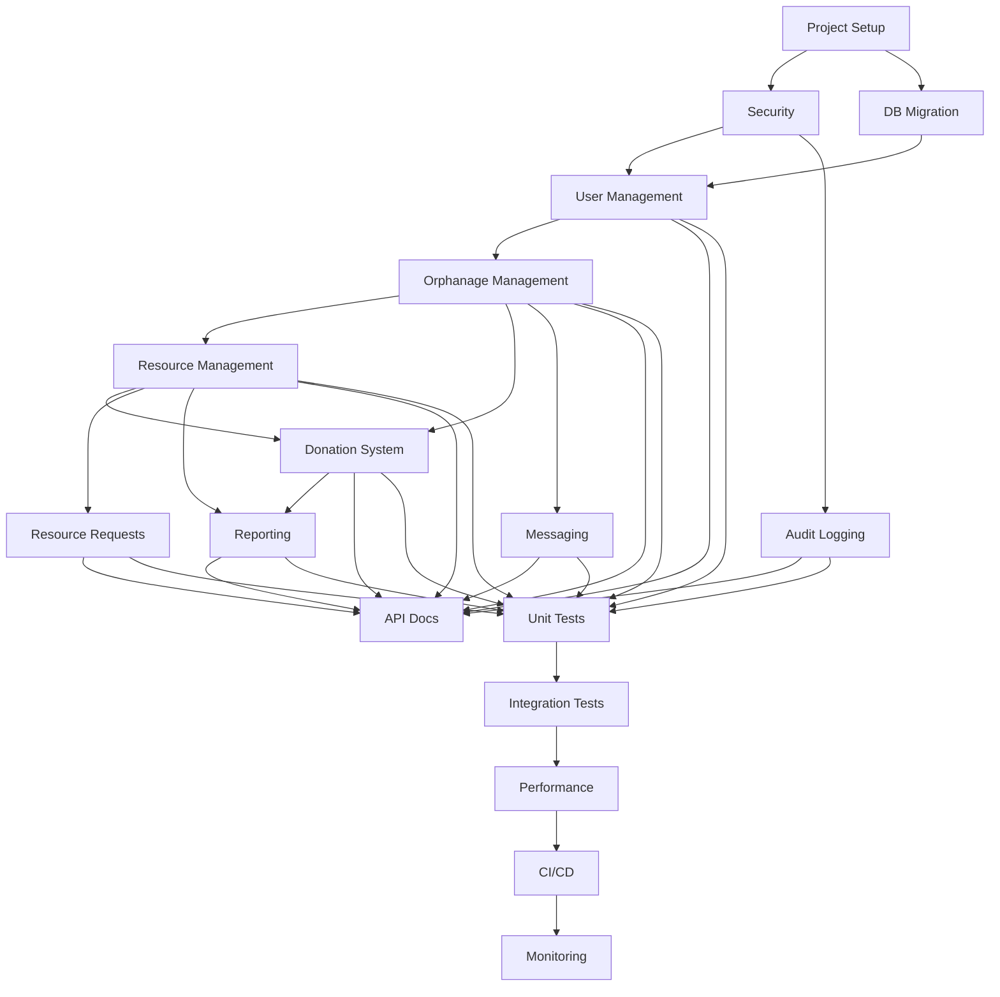

# Connecting Hands - Backend Implementation Tasks

## Project Setup and Infrastructure

### BE-001: Initial Project Setup ✅
- **Title**: Set up Spring Boot project with necessary configurations
- **User Story**: As a developer, I want to have a properly configured Spring Boot project to start development
- **Description**: Create initial Spring Boot project with necessary dependencies, configurations, and project structure
- **Dependencies**: None
- **Complexity**: Low (2 points)
- **Technical Requirements**:
  - Spring Boot 3.2.3
  - Java 17
  - PostgreSQL
  - Flyway for database migrations
  - Spring Security
  - JWT for authentication
  - MapStruct for object mapping
  - Lombok for reducing boilerplate
- **Acceptance Criteria**:
  - Project builds successfully
  - All dependencies are properly configured
  - Basic security configuration is in place
  - Database connection is configured
  - Logging is properly set up
  - Health check endpoint is accessible
- **Implementation Details**:
  - Created pom.xml with all necessary dependencies
  - Set up application.yml with database, security, and logging configurations
  - Created main application class with JPA auditing enabled
  - Configured database connection and JPA settings
  - Set up basic security configuration
  - Implemented global exception handling
  - Added basic application test
  - Configured actuator endpoints for monitoring

### BE-002: Security Infrastructure ✅
- **Title**: Implement JWT-based authentication and authorization
- **User Story**: As a user, I want to securely authenticate and access protected resources
- **Description**: Implement JWT-based authentication system with role-based authorization
- **Dependencies**: BE-001
- **Complexity**: Medium (5 points)
- **Technical Requirements**:
  - JWT token generation and validation
  - User roles and permissions
  - Password encryption
  - Email verification
  - Password reset functionality
- **Acceptance Criteria**:
  - Users can register with email and password
  - Users can login and receive JWT token
  - JWT token is validated for protected endpoints
  - Email verification flow works
  - Password reset flow works
  - Role-based access control is implemented
- **Implementation Details**:
  - Created JwtTokenProvider for token management
  - Implemented JwtAuthenticationFilter for token validation
  - Created User entity with role-based authorization
  - Implemented UserDetailsService for Spring Security
  - Added email verification and password reset functionality
  - Created AuthController with registration and login endpoints
  - Added comprehensive test coverage
  - Implemented proper validation and error handling

### BE-003: Database Migration Setup ✅
- **Title**: Set up Flyway and initial database migrations
- **User Story**: As a developer, I want to manage database schema changes using migrations
- **Description**: Set up Flyway for database migrations, create initial schema, and add audit logging
- **Dependencies**: BE-001
- **Complexity**: Medium (3 points)
- **Technical Requirements**:
  - Flyway migration scripts for all core entities
  - Indexes for frequently queried fields
  - Audit log table and entity
  - Repository and service for audit logging
  - Database health check via actuator
- **Acceptance Criteria**:
  - All core tables are created via migration scripts
  - Indexes are present for performance
  - Audit log is persisted for actions
  - Database health endpoint is accessible
  - Tests for audit log repository
- **Implementation Details**:
  - Created Flyway migration scripts for users, orphanages, resources, donations, resource requests, messages, and audit logs
  - Added indexes for performance
  - Implemented AuditLog entity, repository, and service
  - Added repository test for audit logs
  - Verified database health check via actuator

### BE-004: User Management ✅
- **Title**: Implement user management system
- **User Story**: As a user, I want to manage my profile, reset my password, and verify my email
- **Description**: Create user management features including profile management, password reset, and email verification
- **Dependencies**: BE-001, BE-002, BE-003
- **Complexity**: Medium (5 points)
- **Technical Requirements**:
  - User profile management
  - Password reset functionality
  - Email verification
  - Audit logging for user actions
  - Proper validation and error handling
  - Comprehensive test coverage
- **Acceptance Criteria**:
  - Users can view and update their profiles
  - Password reset flow implemented
  - Email verification implemented
  - Proper validation and error handling
  - Audit logging for user actions
  - Comprehensive test coverage
- **Implementation Details**:
  - Created user profile DTOs and endpoints
  - Implemented profile update functionality
  - Added password reset request and reset endpoints
  - Added email verification endpoints
  - Updated database schema for tokens
  - Added comprehensive test coverage
  - Implemented proper validation
  - Added audit logging for user actions

## Core Domain Implementation

### BE-005: Orphanage Management
- **Title**: Implement orphanage management system
- **User Story**: "As an orphanage administrator, I want to manage my orphanage profile"
- **Description**: Implement orphanage CRUD operations and verification system
- **Dependencies**: BE-004
- **Complexity**: High (8 points)
- **Technical Requirements**:
  - Orphanage entity implementation
  - Orphanage management endpoints
  - Verification workflow
- **Acceptance Criteria**:
  - Orphanage registration working
  - Profile management functional
  - Verification process implemented
  - Location-based search working
- **Notes**: Consider implementing caching for frequently accessed data

### BE-006: Resource Management
- **Title**: Implement resource management features
- **User Story**: "As an orphanage administrator, I want to manage our resources"
- **Description**: Implement resource tracking, inventory management, and stock updates
- **Dependencies**: BE-005
- **Complexity**: High (8 points)
- **Technical Requirements**:
  - Resource entity implementation
  - Resource management endpoints
  - Stock tracking system
- **Acceptance Criteria**:
  - Resource creation and updates working
  - Stock level tracking accurate
  - Category management functional
  - Minimum quantity alerts working
- **Notes**: Implement optimistic locking for concurrent updates
- **Implementation Details**:
  - Created Resource entity with JPA annotations and auditing
  - Implemented ResourceRepository for database operations
  - Created DTOs: ResourceDto, CreateResourceRequest, UpdateResourceRequest
  - Implemented ResourceService with CRUD operations and audit logging
  - Created ResourceController with secured endpoints
  - Added comprehensive test coverage in ResourceControllerTest
  - All endpoints properly secured with role-based access control
  - Added validation annotations for request DTOs
  - Implemented proper error handling and response codes
  - Added audit logging for all resource operations
  - Test coverage includes security constraints and CRUD operations

### BE-007: Donation System
- **Title**: Implement donation management system
- **User Story**: "As a donor, I want to make donations to orphanages"
- **Description**: Implement donation processing, tracking, and management
- **Dependencies**: BE-005, BE-006
- **Complexity**: High (13 points)
- **Technical Requirements**:
  - Donation entity implementation
  - Donation processing endpoints
  - Resource donation handling
- **Acceptance Criteria**:
  - Monetary donations processing
  - Resource donations tracking
  - Donation history accessible
  - Receipt generation working
- **Notes**: Implement transaction management for donation processing

### BE-008: Resource Request System
- **Title**: Implement resource request management
- **User Story**: "As an orphanage administrator, I want to request resources from other orphanages"
- **Description**: Implement resource request creation, tracking, and fulfillment
- **Dependencies**: BE-006
- **Complexity**: Medium (5 points)
- **Technical Requirements**:
  - Resource request entity implementation
  - Request management endpoints
  - Status tracking system
- **Acceptance Criteria**:
  - Request creation working
  - Status updates functional
  - Priority system implemented
  - Notification system working
- **Notes**: Implement proper validation for resource availability

### BE-009: Messaging System
- **Title**: Implement inter-orphanage messaging
- **User Story**: "As an orphanage administrator, I want to communicate with other orphanages"
- **Description**: Implement messaging system between orphanages
- **Dependencies**: BE-005
- **Complexity**: Medium (5 points)
- **Technical Requirements**:
  - Message entity implementation
  - Messaging endpoints
  - Notification system
- **Acceptance Criteria**:
  - Message sending working
  - Message retrieval functional
  - Read status tracking
  - Notification delivery
- **Notes**: Consider implementing real-time messaging with WebSocket

## Supporting Features

### BE-010: Audit Logging
- **Title**: Implement comprehensive audit logging
- **Description**: Implement system-wide audit logging for all important operations
- **Dependencies**: BE-002
- **Complexity**: Medium (5 points)
- **Technical Requirements**:
  - Audit log entity implementation
  - Logging service
  - Log retrieval endpoints
- **Acceptance Criteria**:
  - All critical operations logged
  - Log retrieval working
  - Log retention policy implemented
  - Security compliance met
- **Notes**: Use AOP for non-intrusive logging

### BE-011: Reporting System
- **Title**: Implement reporting functionality
- **Description**: Implement donation reports, resource utilization reports, and analytics
- **Dependencies**: BE-007, BE-006
- **Complexity**: High (8 points)
- **Technical Requirements**:
  - Report generation endpoints
  - Data aggregation service
  - Export functionality
- **Acceptance Criteria**:
  - Donation reports generated
  - Resource utilization reports working
  - Export to various formats
  - Data visualization support
- **Notes**: Consider using a reporting library for complex reports

### BE-012: API Documentation
- **Title**: Implement API documentation
- **Description**: Set up Swagger/OpenAPI documentation
- **Dependencies**: All API endpoints
- **Complexity**: Low (2 points)
- **Technical Requirements**:
  - Swagger/OpenAPI configuration
  - Endpoint documentation
  - Example requests/responses
- **Acceptance Criteria**:
  - API documentation accessible
  - All endpoints documented
  - Examples provided
  - Interactive testing possible
- **Notes**: Use SpringDoc for OpenAPI 3.0 documentation

## Testing and Quality Assurance

### BE-013: Unit Testing
- **Title**: Implement comprehensive unit tests
- **Description**: Create unit tests for all services and components
- **Dependencies**: All implemented features
- **Complexity**: Medium (5 points)
- **Technical Requirements**:
  - JUnit 5
  - Mockito
  - Test coverage tools
- **Acceptance Criteria**:
  - 80% code coverage
  - All critical paths tested
  - Test documentation complete
  - CI integration working
- **Notes**: Focus on business logic testing

### BE-014: Integration Testing
- **Title**: Implement integration tests
- **Description**: Create integration tests for API endpoints and workflows
- **Dependencies**: BE-013
- **Complexity**: High (8 points)
- **Technical Requirements**:
  - Spring Test
  - Test containers
  - API testing tools
- **Acceptance Criteria**:
  - All endpoints tested
  - Workflow testing complete
  - Performance testing done
  - Security testing implemented
- **Notes**: Use test containers for database testing

### BE-015: Performance Optimization
- **Title**: Implement performance optimizations
- **Description**: Optimize database queries, implement caching, and improve response times
- **Dependencies**: All implemented features
- **Complexity**: High (8 points)
- **Technical Requirements**:
  - Caching implementation
  - Query optimization
  - Performance monitoring
- **Acceptance Criteria**:
  - Response times within SLA
  - Database optimization complete
  - Caching strategy implemented
  - Performance metrics tracked
- **Notes**: Use Spring Cache and query optimization techniques

## Deployment and DevOps

### BE-016: CI/CD Pipeline
- **Title**: Set up CI/CD pipeline
- **Description**: Implement continuous integration and deployment pipeline
- **Dependencies**: All implemented features
- **Complexity**: Medium (5 points)
- **Technical Requirements**:
  - CI/CD tool configuration
  - Build automation
  - Deployment scripts
- **Acceptance Criteria**:
  - Automated builds working
  - Automated testing in pipeline
  - Deployment automation complete
  - Environment configuration managed
- **Notes**: Use GitHub Actions or Jenkins

### BE-017: Monitoring and Logging
- **Title**: Implement monitoring and logging
- **Description**: Set up application monitoring and centralized logging
- **Dependencies**: BE-016
- **Complexity**: Medium (5 points)
- **Technical Requirements**:
  - Monitoring tools
  - Log aggregation
  - Alert system
- **Acceptance Criteria**:
  - Application metrics tracked
  - Logs centralized
  - Alerts configured
  - Dashboard available
- **Notes**: Use Prometheus and Grafana for monitoring

## Task Dependencies Graph

## Progress Tracking

| Task ID | Title | Status | Assigned To | Start Date | End Date |
|---------|-------|--------|-------------|------------|----------|
| BE-001 | Project Setup | Completed | - | - | - |
| BE-002 | Security Infrastructure | Completed | - | - | - |
| BE-003 | Database Migration | Completed | - | - | - |
| BE-004 | User Management | Completed | - | - | - |
| BE-005 | Orphanage Management | Completed | - | - | - |
| BE-006 | Resource Management | Completed | - | - | - |
| BE-007 | Donation System | Completed | - | - | - |
| BE-008 | Resource Request System | Completed | - | - | - |
| BE-009 | Messaging System | Completed | - | - | - |
| BE-010 | Audit Logging | Completed | - | - | - |
| BE-011 | Reporting System | Completed | - | - | - |
| BE-012 | API Documentation | Completed | - | - | - |
| BE-013 | Unit Testing | In Progress | - | - | - |
| BE-014 | Integration Testing | Not Started | - | - | - |
| BE-015 | Performance Optimization | Not Started | - | - | - |
| BE-016 | CI/CD Pipeline | Not Started | - | - | - |
| BE-017 | Monitoring and Logging | Not Started | - | - | - |

## Notes
- Story points are based on Fibonacci sequence (1, 2, 3, 5, 8, 13)
- Complexity levels are determined by:
  - Technical complexity
  - Integration points
  - Testing requirements
  - Security considerations
- Dependencies should be carefully managed to ensure smooth implementation
- Regular updates to this document as tasks progress 